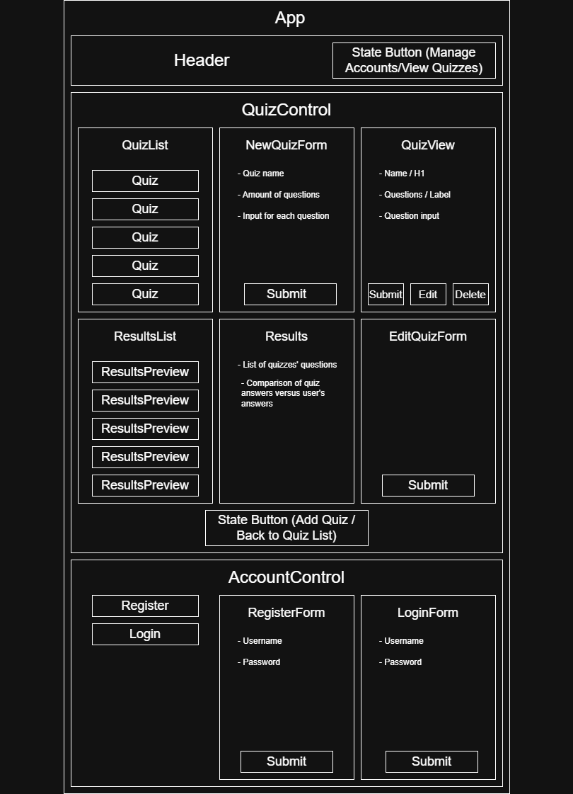

# Quiz Maker

#### _Website for creating and/or taking quizzes or tests._

#### By _**India Lyon-Myrick**_

## Technologies Used

* _Javascript_
* _HTML_
* _CSS_
* _Webpack_
* _Node.js_
* _React.js_
* _Git_
* _Firebase/Firestore_

## Description

_A website where users can create, view, and take quizzes or tests. Users must register for an account and log in before viewing quizzes. Once signed in, the site opens to a list of submitted quizzes. Users can view quizzes to take or create their own from this page. When creating a quiz, users are first asked what they would like to title their quiz, as well as how many questions the quiz should have. After entering the basic information, the second stage of the setup form takes users to write all the questions and their answers, before finally submitting their quiz. Once a quiz is submitted, the creator of the quiz can edit or delete it. The quiz is available for anyone to take, and after a user takes a quiz, they will be shown their results. Results can be viewed by the taker at any time from the site's history page, accessible from the quiz list._

_Component diagram:_

## Setup/Installation Requirements

* _You will need Node.js (`https://nodejs.org/en/download/current`) to run the program._

_1: Clone the repository to a folder of choice on your machine (by either using the "Code" button on the GitHub page, or in a terminal application using `git clone https://github.com/igl-myrick/quiz-maker`)._

_2: Using a terminal application such as Git Bash or Windows Command Prompt, navigate to the top level of the program folder and run `npm install`. This may take some time._

_3: Next, run `npm run build` to build the program._

_4: Once the program is built, run `npm run start` to open and use the program._

## Project Plans

* _Database Refactor (results stored as: data [ question: 'aaa', answer: 'bbb', userAnswer: 'ccc', order: 001 ])_

* _Add some way for users to have a list of results, and indicate a question should give points towards a given result. Potentially have users pick during quiz setup between creating a simple school test-style quiz where they are only given a % score at the end, or a more complex personality test-style quiz with math for calculating each of the quiz creator's results._

* _Rewrite in TypeScript?_

* _Smaller refactors_
  * _Refactor new quiz form to be able to add up to 100 questions, and/or allowing users to add and remove questions as they go_
  * _Additionally refactor NewQuizForm to include:_
    * _option to choose between test or personality quiz_
    * _% calculation for test style quizzes_
    * _input creator's possible answers for personality quizzes_
    * _radio form for what answer a personality quiz question will point towards?_
  * _Allow users to pick between text or radio for a quiz question (only radio allowed for personality quizzes). Max 6? for radio questions. Needs more research_

* _Add styling and light/dark/color themes_

## Known Bugs

* _If a quiz is edited or deleted, accessing results of the quiz taken before the quiz was altered can potentially break the site. Need to rework the database schema to fix this._

## License

_[MIT](/LICENSE.md)_
